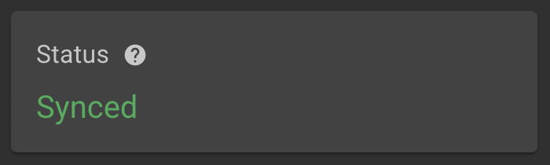
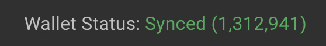
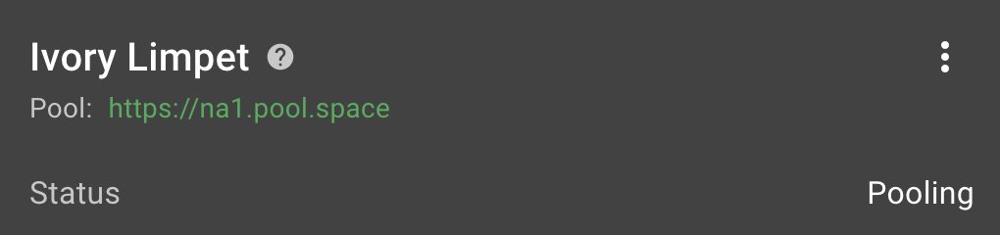
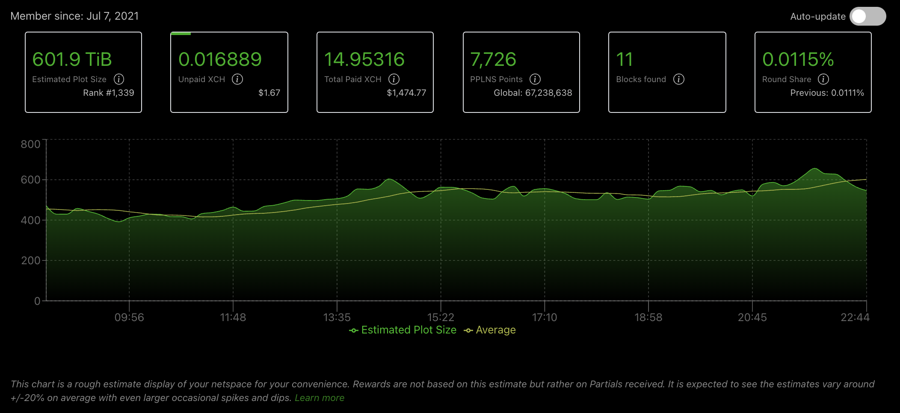

# Chia Farming Quick Start Guide

We're going to start from the complete beginning and by the end of this guide you will be farming Chia! 

If you're not new and just looking for our pool URL, skip to [Joining Space Pool](/#joining-space-pool).

## Chia client installation

First off, you need to [download the chia client](https://www.chia.net/download/). 

## Create or import a wallet 

If you're new to Chia you will create a new wallet. This will generate 24 words. These 24 words are known as your **seed phrase**. Protect these words at all costs, do not share them with **anyone**. we highly advise you write them down and store them in a secure, private place. 

You will also set a passphrase or password. This will prevent people from getting on your computer and tinkering with your Chia client.

## Syncing client (node + wallet)

Once you've created or imported your wallet your client will begin syncing. **Syncing** is the process of downloading the blockchain history. This is a slow process, be patient. 

Under the **full node** tab you should see a message like **Syncing 1,307,402/1,312,726**. Eventually this should say **synced**.

  

In addition to the full node syncing, your wallet must also be synced. Check the **wallets** tab for your **Wallet Status**.

  


## Getting Mojos

Now that you have a synced wallet you can practice receiving some Chia. Request some Chia from the [official Chia faucet](https://faucet.chia.net). Grab your **receive address** from the wallets tab to tell the faucet where to send the Chia. 

It will look something like `xch1am8u5gy9yn3tsn6wzyc0npgfjz97ar4zv7x2pul8vt2x3klfvfwqgtgus2`.

This faucet will send **mojos**, very *very* small fractions of a Chia. Once the transaction is processed you should see a small amount of chia in your wallet balance. 

## Joining Space Pool

Joining a pool is an important step for predictable Chia payouts. Otherwise, it could be years before getting any Chia. 

Visit the **Pool** tab and **add a plot NFT**. A **plot NFT** is a token that represents your participation in a pool. This NFT is unique and is tied to your seed phrase (another good reason to keep your seed phrase secret).

When you create the NFT, you will specify what URL to connect to. Use one of the URLs below (make sure to not have a `/` at the end):

**North America**:
```
https://na1.pool.space
```
**Europe**:
```
https://eu1.pool.space
```
**Asia**:
```
https://asia1.pool.space
```
**Use whatever region is closest to you.** All URLs connect to the same pool, but using the closest URL may improve your connection.

It will ask for a fee amount. For now, do not worry about attaching a fee to this transaction. Leave it blank. 

Because Creating the NFT is a transaction on the blockchain it may take a moment to complete. Once it is complete, you will have a generated name for the plot NFT such as `Ivory Limpet`. This friendly name can help you identify your plot NFT if you have multiple (you only need one, though). 

  

## Adding Plots

New to plotting? **Plotting** is a CPU and disk intensive process to create plot files. Each finished plot increases your XCH reward when farming. More plots = larger farm. 

Once you have a plot NFT you can now create poolable plots. From the **plots** tab select **add a plot**. 
1. Choose a plotter - We recommend **MadMAx plotter**.
1. Plot size - K32.
1. Number of Plots - As many as you can fit! Once created, each plot takes 108.9GB (101.4GiB). You can start with a few to test.
1. Temporary Directory - Create a folder to hold a bunch of random files. **The disk will have a lot of writes** so we suggest using a dedicated SSD for a large number of plots. 
1. Final directory - Create a folder to keep your file plot files organized.
1. Join a pool - Select your plot NFT that is connected to Space Pool.

## Farming

Plotting can take a while. Once a plot is complete, your **number of plots** for your plot NFT increases. Find this in your **pool** tab. 

Farming is a very passive process. It is not CPU intensive and does not use much electricity. As long as the plots are connected on the Chia client and show up in your pool you are good to go!

But wait-- There's one more thing. How do you **know** farming is working?

## Checking your stats with the pool

You use  your **launcher ID** to see your pool stats. You can find this at the bottom of your plot NFT. Visit [Space Pool](https://pool.space) and search for your launcher ID. This will show everything from the pool's POV. 

  


You can look at [other farms](https://pool.space/account/edgar) to see what to expect.

This page will show your partials sent to the pool (happens automatically when farming), estimated farm size, payouts, and more. 

That's pretty much everything to getting started!

## Troubleshooting

Having issues? Reach out on [Space Pool's Discord Community](https://pool.space/discord).
